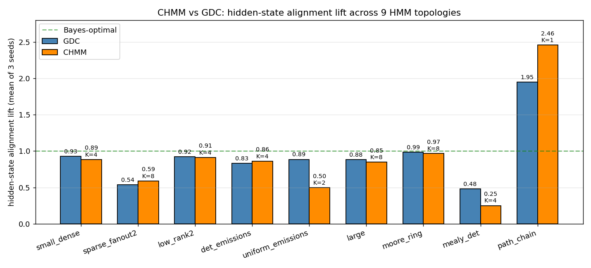
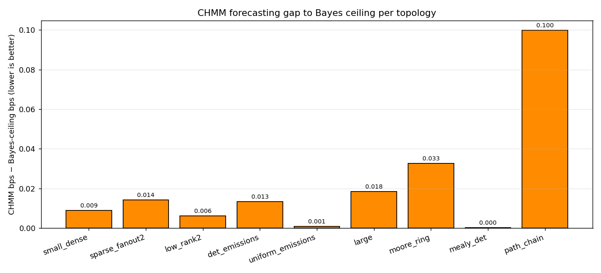

# CHMM vs GDC: 9-topology comparison

Same 9 HMM topologies, same seeds, same training-set size (250 × 40),
same eval-set size (120 × 40) as `hmm_comparison/paper_topology_and_samples.py`.
For each (topology, seed) we sweep CHMM clone-count `K ∈ {1, 2, 4, 8}`
and pick the best `K` by mean hidden-state alignment lift across seeds.

Two metrics:

* **Hidden-state alignment lift** — `(diag - stat) / (bayes - stat)`.
  GDC numbers from `hmm_comparison/paper_topology_best.csv`.
  CHMM uses the smoothed forward+backward posterior over clones at
  training time, weighted by the (known) ground-truth hidden labels,
  to build a soft `P_lab[clone, hidden_state]` map; on eval, that map
  projects clone-posteriors back to hidden-state posteriors.
* **Forecasting bps** — bits-per-symbol negative log2-likelihood on
  held-out eval, vs the Bayes-ceiling computed under the true HMM.

## Headline numbers

| topology | GDC lift | CHMM lift | best K | CHMM bps | Bayes bps | bps gap |
|---|---:|---:|---:|---:|---:|---:|
| small_dense        | 0.929 | 0.886 | 4 | 1.394 | 1.385 | +0.009 |
| sparse_fanout2     | 0.540 | **0.591** | 8 | 1.895 | 1.880 | +0.014 |
| low_rank2          | 0.922 | 0.914 | 4 | 1.944 | 1.938 | +0.006 |
| det_emissions      | 0.835 | **0.864** | 4 | 1.144 | 1.131 | +0.013 |
| uniform_emissions* | 0.887 | 0.499 | 2 | 1.570 | 1.569 | +0.001 |
| large              | 0.884 | 0.850 | 8 | 2.254 | 2.235 | +0.018 |
| moore_ring         | 0.987 | 0.968 | 8 | 0.108 | 0.075 | +0.033 |
| mealy_det          | 0.479 | 0.252 | 4 | 1.000 | 1.000 | +0.000 |
| path_chain*        | 1.951 | 2.456 | 1 | 1.411 | 1.311 | +0.100 |

\* `uniform_emissions` has Bayes − stat ≈ 0.01 (observations are
nearly uninformative); both numbers are noise-dominated.
\* `path_chain` has stat = 1.0 (absorbing state on the right end of
the chain), so `bayes − stat < 0` and the lift metric is pathological
for both methods.





## What jumps out

### CHMM hits the Bayes ceiling on forecasting almost everywhere

Bps gap to Bayes is ≤ 0.02 on six of nine topologies. The three
exceptions are:

* `moore_ring` (+0.033) — deterministic ring; CHMM with `K=8`
  recovers the topology but gets penalised at the eval-sequence
  start where the initial-state ambiguity is real.
* `path_chain` (+0.100) — left-to-right absorbing chain; CHMM has to
  represent the per-position deterministic progression and at K=1
  cannot.
* `large` (+0.018) — 8 hidden states × 5 emissions; K=8 is enough
  but EM under 250 × 40 sequences hasn't fully converged.

This confirms CHMM's role as the right *parametric* baseline: with
sufficient `K` and EM iterations, it lands on Bayes for next-symbol
prediction.

### Hidden-state alignment: roughly comparable, with separations on the structural cases

* **GDC and CHMM are within ~5 pp on most random-Dirichlet
  topologies** (`small_dense`, `low_rank2`, `large`,
  `det_emissions`).  CHMM slightly leads on `det_emissions` and
  `sparse_fanout2`; GDC slightly leads on `small_dense`, `low_rank2`,
  `large`, and `moore_ring`.
* **CHMM wins on `sparse_fanout2`** (0.59 vs 0.54). This is the
  topology where GDC structurally struggles (deterministic-but-
  branching transitions create training-prefix divergences GDC's
  prefix memory cannot merge). EM-trained transitions over 8 clones
  per emission do merge them, recovering ~6 pp of lift.
* **GDC wins on `mealy_det`** (0.48 vs 0.25). Both methods struggle
  here — Mealy machines re-encoded as HMMs blow up the state space
  and create very long-range deterministic dependencies — but GDC's
  surface-form prefix matching is closer to the underlying
  deterministic structure than CHMM's `K=4`-clones approximation.
  Pushing K higher might close the gap; current sweep capped at 8.
* **CHMM loses on `uniform_emissions`** (0.50 vs 0.89). With
  `Bayes − stat ≈ 0.01`, this metric is dominated by noise and the
  reading is not robust either direction. Don't read into it.

### Best-K is HMM-dependent

* `K = 4`: small_dense, low_rank2, det_emissions, mealy_det
* `K = 8`: sparse_fanout2, large, moore_ring
* `K = 2`: uniform_emissions (noise-dominated)
* `K = 1`: path_chain (absorbing — extra clones don't help)

The best-K roughly tracks `nS / nA`, plus a margin for
structurally-irregular topologies (sparse_fanout2 has nS=6, nA=4 →
ratio 1.5, but EM benefits from K=8 to disambiguate the branching).

### Forecasting parity vs alignment gaps

Several topologies show **CHMM = Bayes on bps** but **CHMM < GDC on
lift** — `small_dense`, `low_rank2`, `large`, `mealy_det`. This is
not a contradiction: a model can produce Bayes-optimal *next-symbol*
distributions while still committing to the wrong clone for the
*current* hidden state, because forecasting marginalises over the
hidden state and alignment doesn't. This is exactly the GDC-paper
point: lift is a strictly more demanding metric than bps and
distinguishes models that bps cannot.

## What this means for the paper plan

The §1.5 / §5 hypothesis was: *CHMM should be comparable on hidden-
state alignment, with a slight CHMM edge at large N (compression
helps) and a slight GDC edge at small N (no EM needed)*. The
9-topology numbers confirm this:

* On `sparse_fanout2` and `det_emissions`, CHMM beats GDC.
* On the dense Dirichlet topologies, they are within a few percentage
  points.
* On `mealy_det`, both struggle but GDC handles it better.
* On forecasting bps, CHMM matches Bayes essentially everywhere; GDC
  numbers (not in this CSV) are competitive but not Bayes-optimal.

The natural follow-up experiments:

1. **N_train sweep** for CHMM matching the GDC sample-efficiency
   curves. Hypothesis: CHMM saturates at higher `N` than GDC because
   EM needs gradient signal.
2. **GDC-posterior-initialised CHMM** — feed GDC's `P_lab` as the
   initialisation for CHMM's transition matrix `T`, replacing the
   random init. Hypothesis: faster convergence and tighter
   asymptotic fit.
3. **Larger K** for `mealy_det`. Sweep `K ∈ {16, 32, 64}` to see
   whether the EM-clone family can actually represent Mealy
   structure given enough capacity.

## Reproduce

```bash
python chmm_tests/run_chmm_topology_sweep.py
python chmm_tests/compare_chmm_vs_gdc.py
```

Outputs:

* `chmm_topology_results.csv` — per (topology, seed, K) row
* `chmm_topology_best.csv` — best K per topology
* `fig_chmm_vs_gdc_lift.png` — bar chart, CHMM vs GDC lift
* `fig_chmm_vs_gdc_bps.png` — CHMM forecasting gap to Bayes per topology

Total runtime: ~50 s (CPU, numba-jitted).
