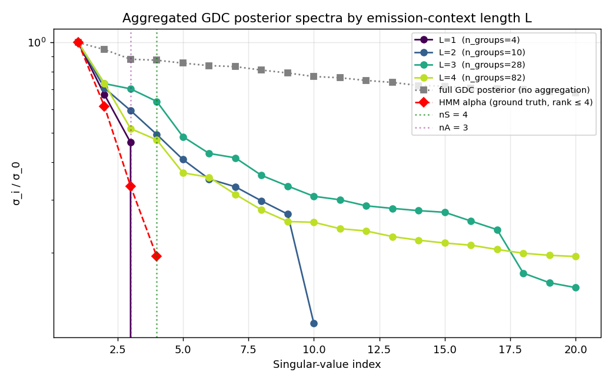
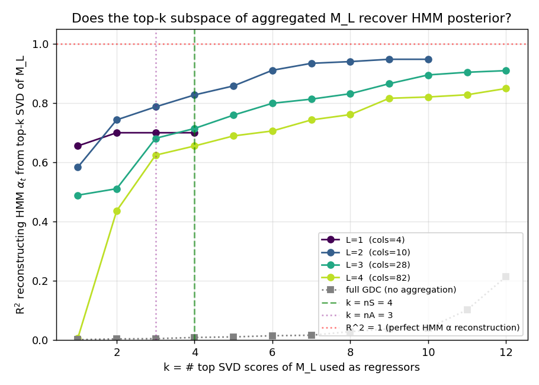

# Aggregating GDC states by emission context exposes nS

Follow-up to the diffusion experiment. There we saw that at full diffusion
(`d → 1`) GDC's posterior matrix collapses to rank `nA`, not `nS`, because
the structured-transition memory has been wiped out. Here we keep GDC at
default (low-diffusion) settings but **aggregate columns by emission
context** before SVD, and ask whether the resulting low-rank matrix carries
the HMM's hidden-state signal.

## Setup

* Same HMM as in `HMM_DIFFUSION_EXPERIMENT.md`: nS=4, nA=3, seed 7.
* GDC at default `alpha=0.7`, `theta=0.2` (`d=0.1`), 200 training sequences
  of length 40 ⇒ 8000 GDC states.
* Eval: 80 sequences of length 40 ⇒ posterior matrix `M ∈ R^{3200 × 8000}`.
  Also compute the HMM forward filter `α_t ∈ R^{nS}` per timepoint to use
  as the supervised target.

For each `L ∈ {1, 2, 3, 4}`:

1. Tag every GDC state `j` with a context id = its training prefix's last
   `L` symbols (`s_{j-L+1}, …, s_j`). Reserve a sentinel bucket for early
   positions where the context is shorter than `L`.
2. Sum columns of `M` within each context bucket → `M_L ∈ R^{3200 × (nA^L+1)}`.
3. Economy SVD of `M_L`. Compute top-k SVD scores `Z_k = U[:, :k] · σ[:k]`.
4. Regress HMM `α_t` on `Z_k` (least squares); report `R²` reconstruction
   as a function of `k`.

Why R² rather than just effective rank? Because aggregation always
produces a matrix of column-rank ≤ `n_groups`, so eff_rank just hits the
column ceiling and tells us nothing. The interesting question is whether
the **top-k** singular subspace of `M_L` *aligns* with the HMM posterior
subspace; R² of `α_t ~ Z_k` measures exactly that.

## Results

### Effective rank just tracks `n_groups` — uninformative

```
L=1   n_groups=  4    eff_rank=  3   PR=  2.74
L=2   n_groups= 10    eff_rank= 10   PR=  7.81
L=3   n_groups= 28    eff_rank= 28   PR= 18.19
L=4   n_groups= 82    eff_rank= 82   PR= 38.46
HMM α              eff_rank=  4   PR=  3.01      ← ground truth
```

Every aggregated matrix is full column-rank. Threshold-based effective
rank just equals `n_groups`. PR is a smooth function of the column count.
*Neither metric singles out `nS = 4`.*

### Spectrum



You can see the cliff at index `n_groups` for each `L` (rank cap), but
within the dominant directions there's no sharp knee at `k = 4`. The
HMM `α` reference (red diamonds) shows the ideal: 4 dominant values,
abrupt drop after.

### R² recovery of HMM `α_t` from top-k SVD scores



This is the diagnostic that works.

| `L` | R²(k=1) | R²(k=2) | R²(k=3=nA) | **R²(k=4=nS)** | R²(k=10) | R²(k=12) |
|----:|--------:|--------:|----------:|---------------:|---------:|---------:|
| 1   | 0.655   | 0.700   | 0.699     | 0.699          | 0.699    | 0.699    |
| 2   | 0.583   | 0.745   | 0.789     | **0.827**      | 0.948    | —        |
| 3   | 0.489   | 0.510   | 0.683     | 0.714          | 0.864    | 0.910    |
| 4   | 0.005   | 0.435   | 0.626     | 0.655          | 0.819    | 0.849    |
| full GDC (no agg) | 0.001 | 0.001 | 0.005 | 0.009 | 0.099 | 0.214 |

Reading the table:

* **L=1** caps at **R² = 0.70 at `k = nA = 3`** and stays flat after. There
  are only 3 nonzero singular values, and they explain at most 70% of
  HMM-`α` variance — the rest cannot be recovered from emission-only
  identity. **This matches the diffusion experiment's `d → 1` result
  exactly: emission alone gets you `nA` dims, no more.**

* **L=2** is the sweet spot. The R² curve rises steeply from `k=1` to
  `k=4` (0.58 → 0.83) and then *flattens* — the increment per direction
  drops by ~3× past `k = nS`. By `k = 10` (full column rank) it reaches
  0.95, almost perfect HMM-α reconstruction.

* **L=3, L=4** still recover HMM α (R² → 0.91, 0.85) but more slowly:
  the additional columns dilute the signal, so the per-direction gain is
  smaller.

* **Unaggregated GDC** (grey curve) is dramatically worse — R² at `k=12`
  is only 0.21. The top SVD directions of the raw 8000-column matrix are
  *not* aligned with HMM-α structure at all. They are dominated by
  training-prefix-identity variation.

### Why does the L=2 R² curve elbow at exactly `k = nS = 4`?

`α_t` is a 4-dim probability vector that lives in a 3-dim simplex (one
constraint: sums to 1). With L=2 emission context, the GDC posterior
captures essentially all the information needed to reconstruct that 4-dim
state distribution — modulo a small noise tail from training-prefix-
sampling artefacts. Each additional SVD direction beyond `k = 4` of
`M_L` cleans up that noise; none of them adds genuine HMM-state
information.

The elbow is the signature we wanted from the very first dimensionality
experiment. It only appears once two conditions are met:

1. Aggregate by emission context to kill the training-prefix-identity
   noise that flattens the global spectrum.
2. Score subspace alignment against an HMM-state target (or any
   sufficient statistic), not by raw spectrum shape.

## Takeaways

1. **Aggregation by emission context (L=2) reveals `nS`** — clearly,
   through an R² elbow at `k = nS = 4`. Top-4 SVD components of the
   aggregated matrix recover 83% of HMM-`α` variance, top-10 recover 95%.
2. **L=1 caps at `nA`** — exactly matching the diffusion-experiment
   prediction; the user's intuition that "single-symbol context = `nA`-dim
   ceiling" is precisely right.
3. **Effective rank and participation ratio are not the right metrics**
   here — they collapse to `n_groups` and don't expose the elbow.
   Subspace-alignment metrics like `R²(α_t ~ top-k SVD scores)` are.
4. **The full unaggregated GDC posterior remains hostile to SVD** — its
   top directions are dominated by per-training-prefix noise and barely
   align with HMM-α. The aggregation step is what makes the SVD
   informative.

## Reproduce

```bash
python hmm_comparison/aggregate_experiment.py
```

Outputs: `aggregate_results.csv`, `fig_aggregate_scree.png`,
`fig_aggregate_effrank.png`, `fig_aggregate_r2.png`.
