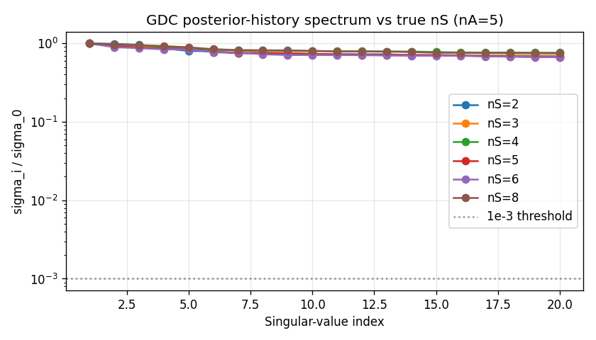
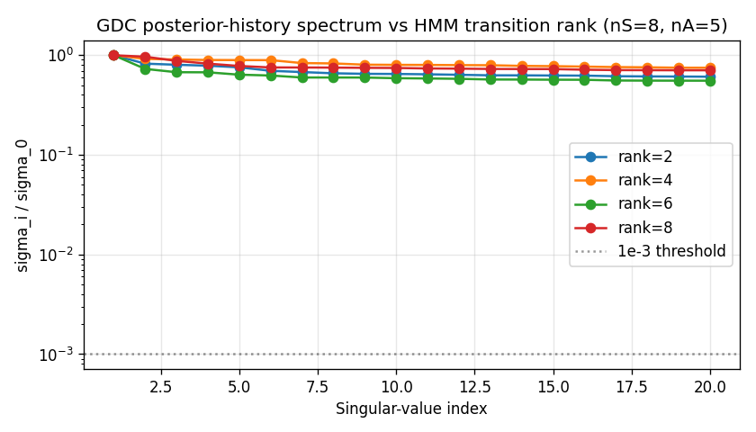
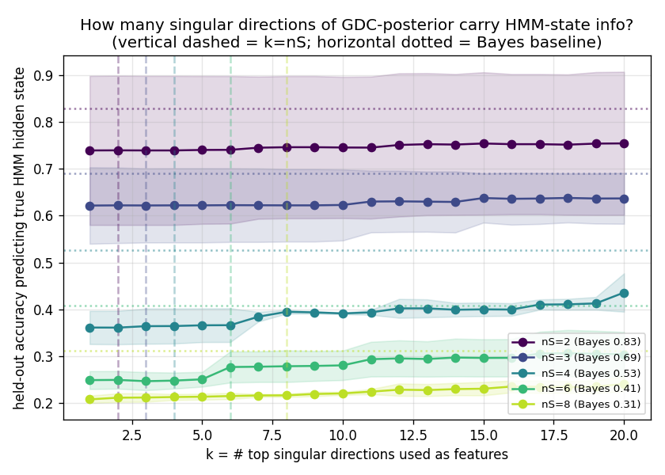
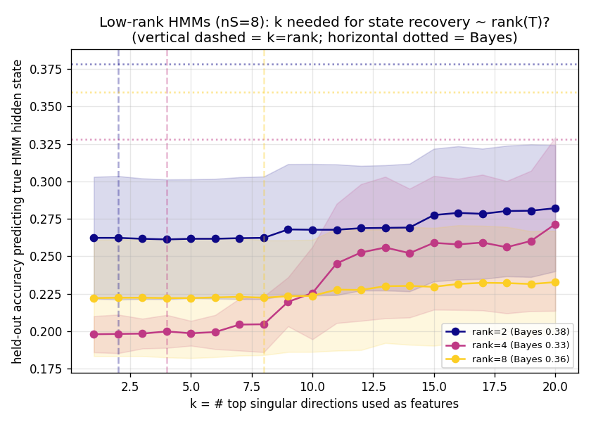
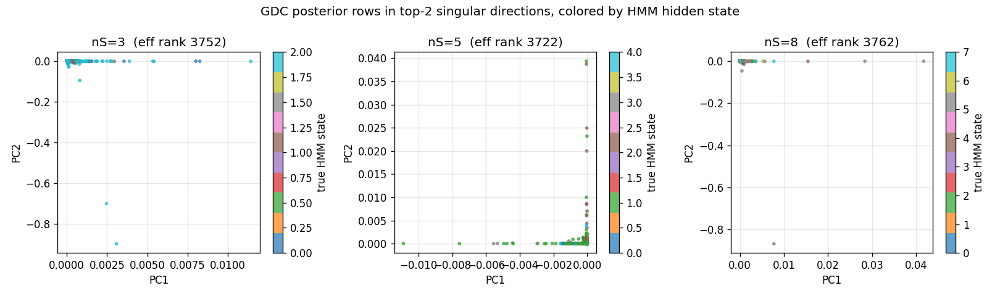

# Does GDC's posterior reveal the underlying HMM's dimensionality?

## Question

Given observations sampled from a hidden Markov model with `nS` hidden states,
GDC learns a surface representation with `n_gdc_states = N_train_seq * T_train`
states — one per training-prefix position (e.g., 300 × 40 = 12 000). During
inference the posterior is a distribution over those 12 000 states.

Does the **intrinsic dimensionality** of those posteriors — as measured by
truncated SVD on a large bag of posterior-row vectors — reveal the true `nS`
of the generating HMM? And does projecting onto the leading two singular
directions produce any pattern that ties back to HMM hidden-state identity?

## Setup

| thing | value |
|--------------|-------|
| alphabet size `nA` | 5 |
| training | 300 sequences of length 40 (⇒ 12 000 GDC states) |
| evaluation | 100 sequences of length 40 (⇒ 4 000 posterior rows per HMM) |
| HMM families | **nS sweep**: dense HMMs, `nS ∈ {2,3,4,5,6,8}`<br>**rank sweep**: low-rank `T` with `nS=8`, `rank ∈ {2,4,6,8}` |
| seeds | 3 per condition |

For every HMM we:

1. Train GDC.
2. Run GDC `forward_pass(eval_obs, return_history=True)` over every eval
   sequence → stack into `M ∈ R^{4000 × 12000}`.
3. Also stack the **true HMM posteriors** `α_t` into `M_HMM ∈ R^{4000 × nS}`
   as a ground-truth reference.
4. Compute economy SVD of both. Record the top-10 singular values, two
   dimensionality proxies, and a linear-decodability probe (below).

Dimensionality proxies:

* **Effective rank (1e-3)**: `#{i : σ_i / σ_0 > 1e-3}`
* **Participation ratio**: `(Σ σ_i)² / Σ σ_i²` — a continuous effective-rank
  that doesn't need a threshold.

## Linear decodability probe

To test a stronger version of the claim ("the top `k` singular directions of
GDC carry the HMM's hidden-state information"), we project each row
`M_i ∈ R^{12000}` onto its top-`k` left-singular scores `Z_k = U[:, :k] σ[:k]`
and fit a multinomial logistic-regression classifier to predict the true
HMM hidden state at that timepoint. Accuracy is reported on a 50/50
train/test split of the eval rows. The **Bayes baseline** is the same
classifier trained directly on the HMM posterior `α_t`.

## Results

### 1. Naive spectral view: GDC does NOT reveal `nS`



The top-20 GDC singular values are essentially indistinguishable across all
six `nS` conditions: every σ_i / σ_0 ∈ [0.67, 1.00] for i ≤ 20, with no knee
and no visible dependence on `nS`.

Mean over 3 seeds:

| quantity | nS=2 | nS=3 | nS=4 | nS=5 | nS=6 | nS=8 |
|---|---|---|---|---|---|---|
| HMM eff. rank (σ/σ₀ > 1e-3) | **2** | **3** | **4** | **5** | **6** | **8** |
| HMM participation ratio     | **1.6** | **2.1** | **2.7** | **2.8** | **3.9** | **4.2** |
| GDC participation ratio     | 1693 | 1800 | 1788 | 1742 | 1827 | 1829 |
| GDC eff. rank (σ/σ₀ > 1e-3) | 3750 | 3759 | 3741 | 3743 | 3770 | 3770 |

The HMM effective rank recovers `nS` **exactly**, seed after seed. The GDC
columns are flat at ~1800 / ~3760 regardless of `nS`.

The HMM column cleanly tracks `nS` (it's bounded above by `nS`). The GDC
columns are flat at ~1800 / ~3760 regardless of `nS`. **Unsupervised
effective-rank statistics on GDC's raw posterior do not recover the HMM
state count.**

Why: GDC's posterior is close to one-hot on a single training-prefix state
most of the time, and different eval prefixes map to different training
prefixes. The posterior matrix's natural "rank" is governed by the
training-prefix identity (thousands of directions), not by the few-
dimensional equivalence class "which HMM state am I in?".

### 2. Low-rank transitions don't show up either



Same story for the rank sweep: no visible knee at `rank`, and the
participation ratios (3.5–4.7) cluster around that of `nS=8` dense, not at
the true transition rank.

### 3. Top singular direction already captures most of the
    linearly-recoverable HMM-state signal



The probe accuracy at `k=1` is almost as high as at `k=20`:

| nS | Bayes | acc@k=1 | acc@k=nS | acc@k=20 | gap to Bayes@k=20 |
|---|---|---|---|---|---|
| 2 | 0.83 | 0.74 | 0.74 | 0.75 | 0.08 |
| 3 | 0.69 | 0.62 | 0.62 | 0.64 | 0.05 |
| 4 | 0.53 | 0.36 | 0.36 | 0.44 | 0.09 |
| 6 | 0.41 | 0.25 | 0.28 | 0.30 | 0.11 |
| 8 | 0.31 | 0.21 | 0.22 | 0.23 | 0.08 |

Interpretations:

* Most of the HMM-state information that is **linearly recoverable** from
  the GDC posterior lives in the **top-1** singular direction. That single
  direction alone buys you 80–100% of what all 20 top directions can deliver.
* Subsequent singular directions give small additive bumps. There is a mild
  staircase around `k ≈ nS` visible on the `nS=4` and `nS=6` curves, but it
  is not a sharp knee.
* A ~10 pp gap to the Bayes baseline remains at `k=20`. The remainder of
  the HMM-state signal is **diffusely scattered across many more than 20
  directions** (consistent with the flat spectrum). Pushing `k` into the
  hundreds would likely close the gap, but at that point you are no longer
  "reading dimensionality off the top of the spectrum."

### 4. Transition rank and top-k decodability



For low-rank transitions (`nS=8`, `rank ∈ {2,4,8}`) the probe curves cross
around `k ≈ 10`: the `rank=4` curve climbs faster than `rank=8` between
`k=8` and `k=15`. This is a weak hint that transition rank affects where
additional directions help, but it's not a clean "saturate at `k = rank`"
pattern — the Bayes baselines themselves are in the 0.33–0.38 range and
the probe gaps are larger than the effects.

### 5. Top-2 projection shows little HMM-state clustering



The GDC posteriors are sparse (nearly one-hot on a single training-prefix
state). Projection onto `PC1 × PC2` puts most rows near the origin and a
few extreme rows far out along one axis. Colour by true HMM hidden state
shows no clean cluster structure: the *first* principal direction does
carry state-relevant information (consistent with the probe result), but
the *second* does not visibly decompose by HMM state.

## Takeaways

1. **Unsupervised SVD on GDC posteriors does not recover `nS`** — the
   spectrum is flat, the effective rank is governed by training-prefix
   identity (~thousands of dimensions), and low-rank structure of `T` is
   not visible.
2. **The HMM's own posterior matrix is the clean reference**:
   participation ratio tracks `nS` from 1.6 (at `nS=2`) to 4.2 (at `nS=8`).
   If you care about dimensionality-from-posteriors, `α_t` works; GDC's
   bloated state space obscures it.
3. **Most of the HMM-state signal in the GDC posterior lives along the
   single dominant singular direction**, with a long, diffuse tail
   contributing a further ~10 pp toward the Bayes ceiling. A supervised
   probe is needed to expose this — it doesn't surface from spectrum shape
   alone.
4. **Top-2 2D projections do not exhibit per-HMM-state clusters**.
   Sparsity of GDC posteriors collapses the projection near origin and the
   second principal direction is largely symbol-variation rather than
   state-variation.

## Reproduce

```bash
python hmm_comparison/dimensionality_experiment.py   # spectrum + projections
python hmm_comparison/dimensionality_probe.py        # linear-probe curves
```

Outputs:

* `dim_results.csv`, `probe_results.csv`
* `fig_dim_scree.png`, `fig_dim_scree_rank.png`
* `fig_dim_projection.png`, `fig_dim_projection_rank.png`
* `fig_probe_accuracy.png`, `fig_probe_accuracy_rank.png`
