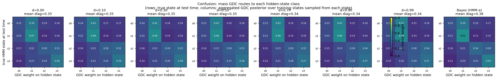
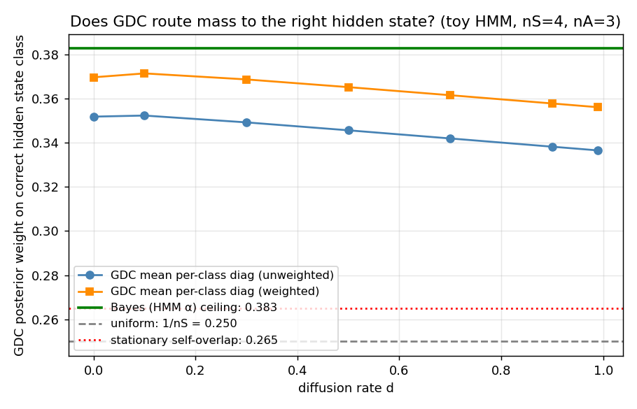

# Does GDC route posterior mass to the correct hidden state?

## Question

We've been treating GDC's surface state space (one state per
training-prefix position) as opaque. Now we open the box: at training
time, every GDC state `j` was emitted from a specific HMM hidden state
`h_train[j]`. At test time we know the true hidden state `s_test[t]`.
**Does GDC's posterior at test-time concentrate mass on training states
that were sampled from the same hidden state?**

The aggregated quantity is:

```
p[t, c]  =  Σ_j  M[t, j] · 1{ h_train[j] == c }
```

where `M[t, :]` is GDC's posterior over its 8000 surface states at test
timepoint `t`. Marginalising over training states grouped by `h_train`
gives a (Ntot × nS) "GDC's belief over hidden states" matrix.

The diagonal of the resulting confusion matrix
`C[i, c] = ⟨ p[t, c] | s_test[t] = i ⟩` is the headline metric: average
mass routed to the *correct* hidden state class.

## Setup

* Same toy HMM as `HMM_DIFFUSION_EXPERIMENT.md`: nS=4, nA=3, seed 7.
* 200 training sequences × length 40 ⇒ 8000 GDC states with hidden-state
  labels `h_train`.
* 80 evaluation sequences × length 40 ⇒ 3200 timepoints with
  `s_test` and observation `o_test`.
* Sweep diffusion `d ∈ {0, 0.1, 0.3, 0.5, 0.7, 0.9, 0.99}`.
* Compare against three baselines:
  - **Uniform**: 1/nS = 0.250 (random GDC posterior).
  - **Stationary self-overlap**: Σ π²_stat = 0.265 (mass GDC would put on
    correct state if it just used the stationary marginal).
  - **Bayes ceiling**: HMM's own forward filter `α_t[s_test[t]]` averaged
    the same way. This is the maximum achievable from the observations
    alone.

## Results

### Confusion matrices vs diffusion (with Bayes panel on the right)



Reading the panels (rows = true hidden state at test time, columns = mass
GDC routes to each hidden-state class):

* **All GDC panels are essentially identical to the Bayes panel** (right).
  Cell-by-cell differences are typically < 0.05.
* The dominant feature is **s0 ↔ s1 confusion**: when truly in s0, both
  Bayes and GDC route most mass to s1 (0.39–0.43). This is a property of
  the HMM, not GDC: looking at the diagram, s0 and s1 both emit mostly
  symbol 0 with strong self-loop weight on s1 — they are nearly
  emission-equivalent, so observations alone can't tell them apart.
  Bayes itself only puts 0.25 mass on s0 when in s0.
* s2 ↔ s3 also confuse modestly (0.25–0.34 each way). s1 and s3 are the
  cleanest states (47% and 39%).

### Mean diagonal vs diffusion



| baseline / quantity | mean diagonal |
|---|---|
| Uniform (1/nS) | 0.250 |
| Stationary self-overlap | 0.265 |
| **GDC at d=0.0** | **0.352** |
| GDC at d=0.1 | 0.352 |
| GDC at d=0.5 | 0.346 |
| GDC at d=0.99 | 0.336 |
| **Bayes (HMM α) ceiling** | **0.383** |

GDC routes 35.2% of its mass to the correct hidden state class, vs a
Bayes ceiling of 38.3% and a stationary baseline of 26.5%.

**Position relative to the achievable range:**

```
(GDC - stationary) / (Bayes - stationary)
  =   (0.352 - 0.265) / (0.383 - 0.265)
  =    0.087 / 0.118
  =    0.74
```

GDC captures **~74% of the achievable above-prior signal** from
observations alone. The remaining 26% gap is a real shortfall: GDC's
sampling-based prior (the 8000-state surface form) doesn't quite match
the HMM's exact forward filter.

### Diffusion has almost no effect

The mean diagonal drops only from 0.352 (d=0) to 0.336 (d=0.99) — a 1.6
percentage-point change across two orders of magnitude in transition
memory. Why?

At **low d** the posterior concentrates on a single training prefix; that
prefix's `h_train` label is biased toward the correct state because
emission likelihood was used to pick it.

At **high d** every transition step replaces the structured term with a
uniform spread, but the emission-likelihood multiplication is still
applied at each step. So the posterior becomes a uniform-over-prefixes
weighted by current-emission-likelihood — and again, that's biased toward
training states whose emissions match the current observation, which
themselves are biased toward the correct hidden state.

Both regimes are dominated by the same emission-likelihood signal. The
transition-memory term contributes only a small additional bias (the 1.6
pp drop).

### Per-class breakdown

| state | Bayes diag | GDC diag (d=0) | gap |
|------|-----------|-----------------|-----|
| s0   | 0.254     | 0.246           | 0.008 |
| s1   | 0.506     | 0.470           | 0.036 |
| s2   | 0.338     | 0.296           | 0.042 |
| s3   | 0.433     | 0.395           | 0.038 |

GDC's gap to Bayes is small and roughly uniform across classes (~0.03–
0.04). The hardest state for both is **s0** (~25% mass even at Bayes,
because it overlaps emission-wise with s1).

## Takeaways

1. **GDC routes mass meaningfully to the correct hidden state class** —
   not perfectly, but at 74% of the achievable above-prior signal. The
   confusion structure mirrors Bayes almost exactly, because the dominant
   confusion (s0↔s1) is forced by the HMM's emission structure, not by
   GDC.
2. **The HMM-state weight assigned by GDC tracks the Bayes-optimal
   estimator within ~3-4 pp per class.** GDC is not just a soft prefix-
   matcher — its posterior carries genuine hidden-state information, just
   not at the full Bayes-optimal sharpness.
3. **Diffusion has near-zero effect on this alignment.** The dominant
   driver of correct-class routing is emission likelihood, which is
   present in every regime. Transition memory contributes only ~1.6 pp
   of additional bias on this HMM.
4. **The ceiling itself is far from 1.** Even Bayes-optimal inference
   only puts 0.38 mass on the correct state, because the HMM's emission
   distributions overlap. GDC living at 0.35 vs a 0.38 ceiling is much
   tighter than the absolute number suggests.

This connects back to the SVD experiments cleanly. The reason
aggregation-by-emission-context (`L=2`) recovers the HMM's `α_t` at
R²=0.95 is *because* the emission-likelihood bias is doing most of the
work: column groupings already approximate `h_train`-equivalence
classes, so summing posterior mass within them recovers GDC's belief
about the hidden state.

## Reproduce

```bash
python hmm_comparison/hidden_state_alignment.py
```

Outputs:
* `hidden_alignment_results.csv`
* `fig_hidden_alignment_confusion.png` (per-d confusion + Bayes panel)
* `fig_hidden_alignment_summary.png`   (diagonals vs d, with baselines)
