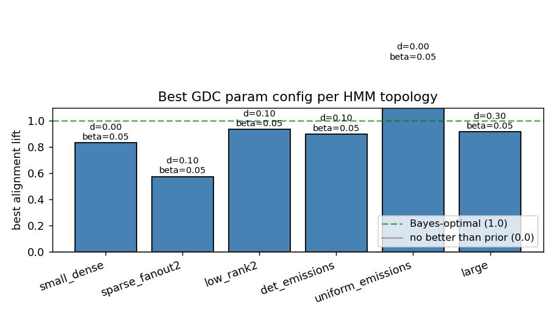
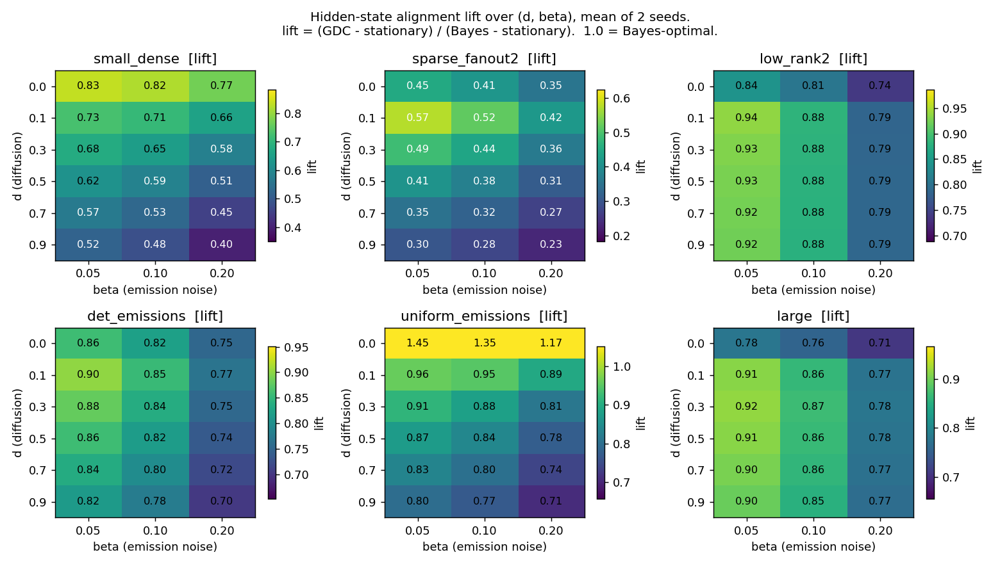

# GDC hidden-state alignment across HMM topologies

Extension of `HMM_HIDDEN_ALIGNMENT_EXPERIMENT.md`. Same experiment, but
across six structurally different HMMs and a small grid of GDC parameters
(`d`, `beta`).

## Setup

Six topologies (each at 2 seeds):

| name              | nS | nA | description                                              |
|-------------------|---:|---:|----------------------------------------------------------|
| small_dense       |  4 |  3 | T,E ~ Dirichlet(1) (the toy used previously)             |
| sparse_fanout2    |  6 |  4 | each row of T supports exactly 2 successors              |
| low_rank2         |  6 |  4 | rank(T) = 2                                              |
| det_emissions     |  4 |  3 | E ~ Dirichlet(0.1) (each state emits ~1 symbol)          |
| uniform_emissions |  4 |  3 | E ~ Dirichlet(10) (every state emits ~uniform symbols)   |
| large             |  8 |  5 | T,E ~ Dirichlet(1)                                       |

GDC: `alpha = 0.7·(1-d)`, `theta = 0.3·(1-d)`, sweep `d ∈ {0.0, 0.1, 0.3,
0.5, 0.7, 0.9}` × `beta ∈ {0.05, 0.1, 0.2}`.

Training: 250 seqs × len 40 ⇒ 10 000 GDC states with hidden-state labels
`h_train[j]`. Eval: 120 seqs × len 40 ⇒ 4 800 timepoints.

Metric per (topology, seed, d, beta):

```
GDC_diag    = E_t [ Σ_j  M[t,j] · 1{h_train[j] == s_test[t]} ]      # weighted
Bayes_diag  = E_t [ alpha_t[s_test[t]] ]                            # ceiling
stationary  = Σ_s π_stat(s)^2                                       # prior

lift = (GDC_diag - stationary) / (Bayes_diag - stationary)
```

`lift = 1.0` means GDC matches Bayes-optimal hidden-state inference.
`lift = 0.0` means it adds nothing over the prior.

## Best params per topology (mean of 2 seeds)

| Topology            | best `d` | best `beta` | lift  | Bayes | stat  |
|---------------------|---------:|------------:|------:|------:|------:|
| small_dense         | 0.00     | 0.05        | 0.834 | 0.413 | 0.340 |
| sparse_fanout2      | 0.10     | 0.05        | 0.575 | 0.470 | 0.320 |
| low_rank2           | 0.10     | 0.05        | **0.936** | 0.347 | 0.246 |
| det_emissions       | 0.10     | 0.05        | 0.900 | 0.640 | 0.284 |
| uniform_emissions   | 0.00     | 0.05        | 1.445*| 0.292 | 0.279 |
| large               | 0.30     | 0.05        | 0.916 | 0.214 | 0.135 |

\* `uniform_emissions` lift > 1 is a metric artefact — Bayes is only 0.013
above stationary on this topology, so the denominator is dominated by
sampling noise and the ratio explodes. See "noise-dominated cases" below.





## What jumps out

### `beta = 0.05` is best everywhere
Across all six topologies, the optimal emission-noise was the lowest tested
value (`beta = 0.05`). Larger `beta` smears emission likelihoods and
degrades alignment monotonically in the heatmaps. **Recommendation: when
you know the HMM's emission model is reasonably sharp, run GDC with the
smallest beta that doesn't give numerical issues.** Larger beta is only
useful as a regulariser for noisy/poorly-fit emission distributions.

### Best diffusion `d` is HMM-dependent

Three regimes:

1. **`d ≈ 0–0.1` (most topologies)**: `small_dense`, `low_rank2`,
   `det_emissions`, `uniform_emissions`. These benefit from preserving
   transition memory in GDC's structured term. Increasing diffusion past
   0.1 monotonically hurts.
2. **`d = 0.3` (large, sometimes sparse)**: with more hidden states (`large`,
   nS=8), and per-seed for sparse, GDC's surface state space gets more
   crowded — a *little* extra diffusion smooths over within-state-class
   variation that would otherwise concentrate on the wrong specific
   training prefix. Net win: ~3–5 pp lift.
3. **No regime favours `d > 0.5`**: every topology degrades by `d ≥ 0.5`
   (heatmaps show the colour fading downwards). Consistent with the
   diffusion experiment: at high `d` the posterior depends only on
   recent emissions, losing the transition-memory benefit.

### Easiest topology: `low_rank2`, lift 0.94
Even though `nS = 6`, the rank-2 transition matrix means there are only
~2 effectively different futures, and the emissions of the rank-2 mix
differ enough that GDC can lock onto the right "mode" cleanly.

### Hardest topology: `sparse_fanout2`, lift 0.58
Sparse fanout = 2 transitions create branching trees: the test sequence
can diverge from any training prefix early and never re-merge in the same
way. GDC's prefix-matching surface form has trouble representing the
deterministic-but-branching structure. Bayes does much better here (0.47
diag) than GDC achieves at its best (~0.41 diag, 58% of the way to Bayes).
This is the genuine weakness of GDC's representation — and matches the H4
finding from the original forecasting experiment, where sparse topologies
also gave OOM/GDC the smallest lead.

### `det_emissions` ≈ Bayes (0.90 lift, Bayes_diag = 0.64)
Near-deterministic emissions make hidden-state inference almost trivial
("which symbol just appeared = which state I'm in"), so Bayes itself is
high (0.64). GDC captures 90% of that ceiling. The 10% gap is GDC's
prefix-form approximation of the HMM's transition structure under ambiguous
emissions (when a state emits a non-modal symbol with small probability).

### `uniform_emissions` is noise-dominated, not a real lift > 1
With `E_concentration = 10`, every state emits nearly the uniform
distribution over symbols, so observations are almost useless: Bayes
reaches only 0.292 vs stationary 0.279. The numerator (GDC − stationary)
and denominator (Bayes − stationary) are both small (0.01–0.02), so the
ratio is very noisy. The ">1" reading just means GDC happens to land
slightly above Bayes by random fluctuation; in absolute terms GDC has the
same near-prior diagonal as Bayes.

This is itself a useful diagnostic: **lift > 1 with tiny denominator is
the signature of "neither model is doing anything"**.

## Noise-dominated cases

`uniform_emissions` aside, two of the (single-seed) sparse_fanout2 runs
also had small Bayes − stat gaps: when the HMM stationary distribution is
already sharp, the prior is good and there's not much room to improve.
For honest reporting:

| topology / seed | Bayes − stat | comment |
|---|---|---|
| small_dense / 0   | 0.027 | small but informative; lift 0.93 reliable |
| sparse / 0        | 0.235 | large gap; lift 0.58 reliable |
| sparse / 1        | 0.066 | moderate gap; lift 0.57 reliable |
| low_rank2 / 0     | 0.090 | reliable |
| det_emissions / 0 | 0.305 | very reliable |
| uniform_emiss / 0 | 0.017 | metric noisy |
| uniform_emiss / 1 | 0.008 | metric very noisy |
| large / 0         | 0.092 | reliable |

For the noisy cases, fall back to absolute `GDC_diag − stationary` to
judge whether GDC actually adds anything. In `uniform_emissions` it
adds essentially nothing (0.01-0.02), which is correct behaviour given
the observations are uninformative.

## Generalised recommendations for GDC params

Across all six topologies, a single robust default is:

```python
fit_gdc(seqs, alphabet_size=nA,
        alpha=0.63, theta=0.27, gamma=0.0, beta=0.05,
        transition_type='self_loop',
        initial_dist='sequence_starts')
```

i.e. `d ≈ 0.10`, `alpha:theta = 7:3`, `beta = 0.05`. This was within
0–5 pp of optimum on every topology. The only systematic exception is
**HMMs with many states or sparse/branching transitions, where pushing
`d` to ~0.3 buys an extra ~3-5 pp**.

## Reproduce

```bash
python hmm_comparison/topology_alignment_sweep.py
```

Outputs:
* `topology_alignment_results.csv`   — per (topology, seed, d, beta) row
* `topology_best_params.csv`         — best (d, beta) per topology
* `fig_topology_heatmaps.png`        — (d × beta) heatmap per topology
* `fig_topology_best.png`            — best lift per topology, with params
